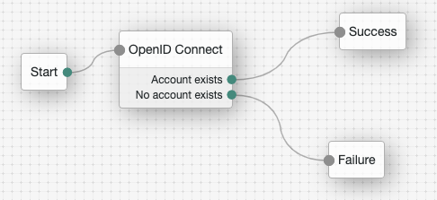

# Keyless Authentication Node

Seamless passwordless multi-factor authentication for your users.

Keyless offers unmatched security, privacy and usability. Our solution allows you to provide frictionless multichannel experience to your users and your increasingly remote workforce, while simultaneously enabling you to improve your security posture, and comply with privacy regulations.

## Prerequisites

As part of your onboarding process with Keyless, you should have received the following:

- OpenID Connect Client ID

- OpenID Connect Secret

- OpenID Discovery URL

If you do not have one or more of these items, please reach out to _support@keyless.io_.

## Configuration

1.  Create or modify a tree to use the OpenID Connect Node

  

2.  Enter the following values for each configuration option in the OpenID Connect Node

| Field Name                      | Value                                                                                                                       |
| ------------------------------- | --------------------------------------------------------------------------------------------------------------------------- |
| Authentication Endpoint URL     | To be found in the provided Discovery URL                                                                                   |
| Access Token Endpoint URL       | To be found in the provided Discovery URL                                                                                   |
| User Profile Service URL        | To be found in the provided Discovery URL                                                                                   |
| OAuth Scope                     | `openid email profile`                                                                                                      |
| Redirect URL                    | Depends on your deployment configuration, typically: `https://your-fr-host-domain/openam/?realm=THE_REALM&service=THE_TREE` |
| Social Provider                 | `Keyless`                                                                                                                   |
| Auth ID Key                     | `sub`                                                                                                                       |
| Use Basic Auth                  | `enabled`                                                                                                                   |
| Account Provider                | `org.forgerock.openam.authentication.modules.common.mapping.DefaultAccountProvider`                                         |
| Account Mapper                  | `org.forgerock.openam.authentication.modules.oidc.JwtAttributeMapper`                                                       |
| Account Mapper Configuration    | `email to uid`                                                                                                              |
| Save Attributes in the Session  | `enabled`                                                                                                                   |
| Token Issuer                    | To be found in the provided Discovery URL                                                                                   |
| OpenID Connect Validation Type  | `JWK URL`                                                                                                                   |
| OpenID Connect Validation Value | To be found in the provided Discovery URL                                                                                   |

## Testing

1.  Open a private window in your browser.
2.  Navigate to the login page of the realm that Keyless is configured for.
3.  Enter your username and authenticate with Keyless on your mobile device (make sure to use a user that is enrolled to Keyless)
4.  You should now be logged into the ForgeRock portal.
